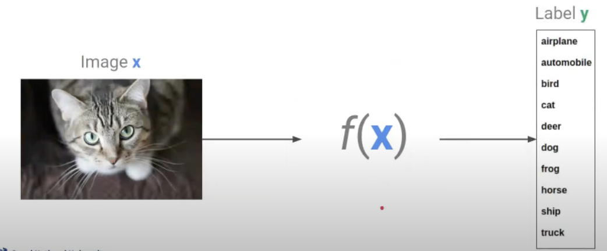
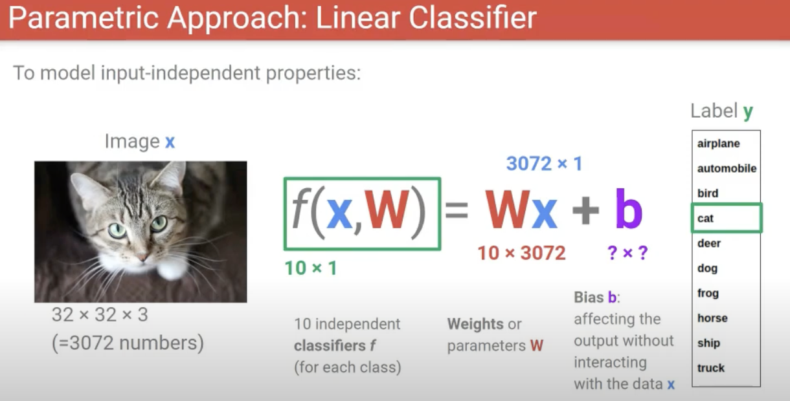
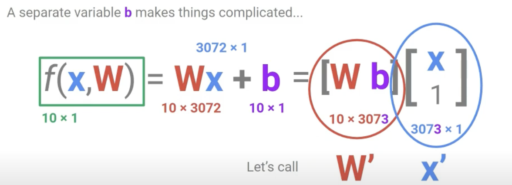
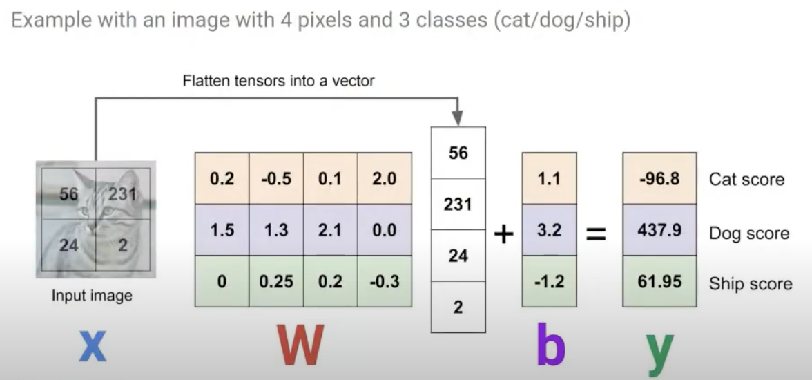
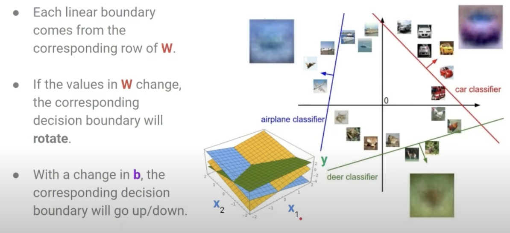
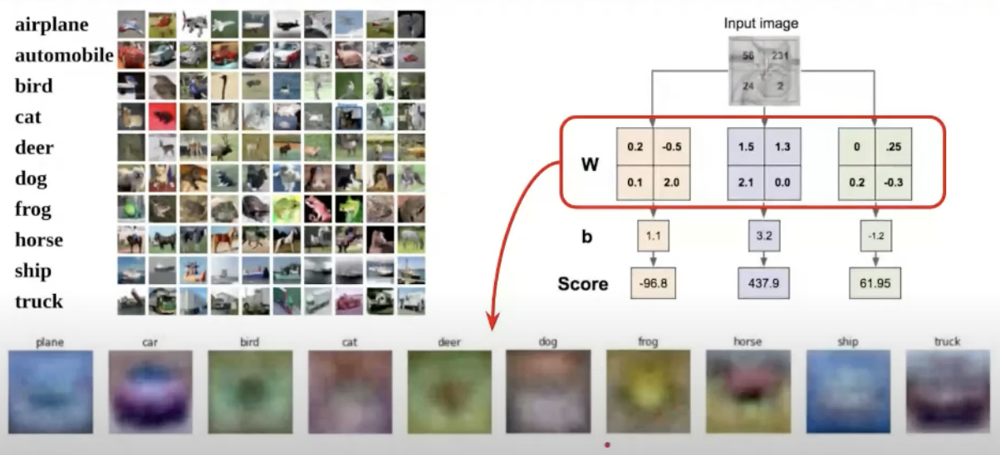

## Linear Classifier

**Linear Function** \
-> weighted sum of input pixels: $$W_1,_1x_1,_1 + W_1,_2x_1,_2 + ... + W_m,_nx_m,_n$$

$$f(x,W) = Wx + b$$
x : 입력 데이터로 3072 x 1 벡터 \
W : 가중치 행렬로, 10 x 3072 크기를 가짐. 여기서 10은 분류해야 할 클래스를 의미 \
b : 편향(bias) 항으로, 출력에 영향을 주지만 x와 직접 곱해지지 않는 항. \
f(x, W): 최종 출력값으로 10 x 1 벡터. 각 숫자는 클래스에 대한 score를 나타냄. 

-> 내부에 항상 bias가 기본적으로 들어가있다고 생각할 것.

### Advantages of parametric models:
- Once trained, what we need is the weights W only. \
We do not need to store the huge training dataset. -> space efficient
- At test time, an example can be evaluated by a single matrix-vector multiplication(Wx). \
-> much faster than comparing against all training data.

Cat 클래스 (첫 번째 행):
$$(0.2)(56) + (-0.5)(231) + (0.1)(24) + (2.0)(2) = 11.2 - 115.5 + 2.4 + 4.0 = -97.9$$

What the linear classifier does is
- At training: learning the template from training data 템플릿을 배우는 과정
- At testing: performing the template matching with a new example 

Similar to kNN in that both compare distances, \
but different from kNN in that linear classifier compares only to K classes, \
while kNN does to N training examples. (usually, K << N)