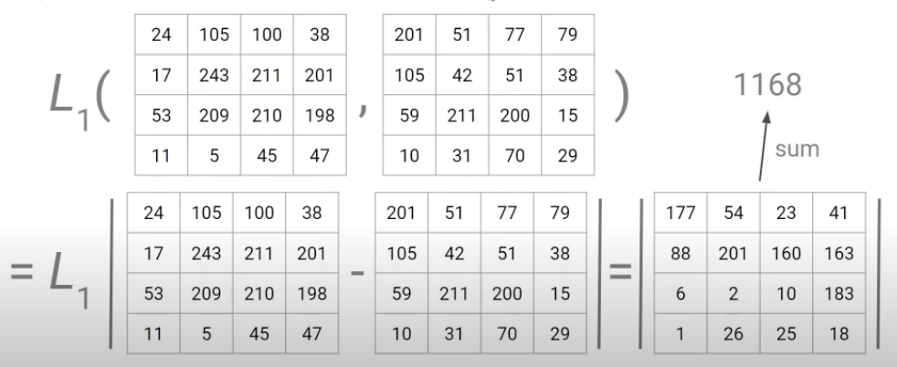
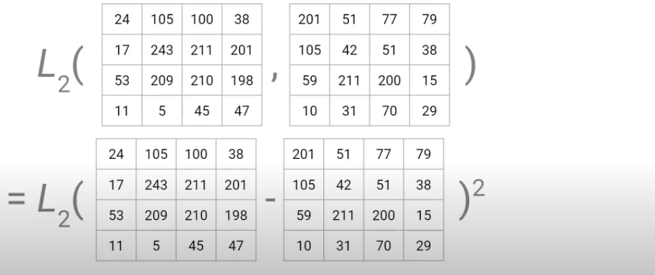

## Machine Learning: Data-Driven Approach
1. Collect a dataset of images and labels.
2. Use a machine learning algorithm to train a classifier.
3. Use the classifier to predict unseen images.

## Nearest Neighbor Classifier
K-Nearest Neighbors with pixel distance are never used
- Distance metrics on pixels are not informative.
- Very slow at test time.
- Cure of dimensionality: need exponentially increasing number of examples for higher dimensional data.

두 행렬 사이의 distance 계산법
1. $$L_1(A,B)  = \sum_{i,j} |A_i,_j - B_i,_j|$$


2. $$L_2(A,B)  = \sqrt{\sum_{i,j} (A_i,_j - B_i,_j)^2}$$


```python
class NearestNeighbor:
    def __init__(self):
        pass

    def train(self, images, lables):
        self.images = images
        self.lables = lables

    def predict(self, test_images):
        min_dist = sys.maxint
        for i in range(self.images.shape[0]):
            dist = np.sum(np.abs(self.images[i, :] - test_images))
            if dist < min_dist:
                min_dist = dist
                min_index = i

        return self.lables[min_index]
```
**Time Complexity** \
With N training examples
- For training? : O(1)
- For prediction? : O(N)

### Nearest Neighbors의 단점에도 불구하고 사용하고 싶다면?
- Consider normalizing the features in your data. 정규화
- Consider deimension reduction, especially if you deal with high-dimensional input such as images. 차원 축소
- Split your training data to train/validation sets, and use the validation set to select the best k and other hyperparameters.
- For faster computation, there are approximate nearest neighbors library available.